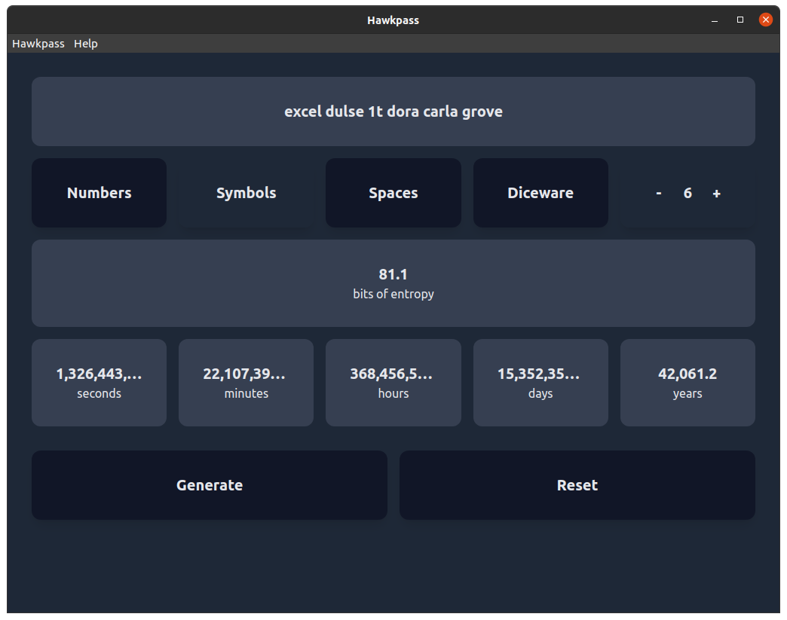

<p align="center">
  
</p>
<p align="center">
  
  
  
  
  
</p>

A simple cross-platform cryptographically secure (SHA-256) random number generator that uses entropy collected from your mouse movements to generate **easy to remember** passwords based on the [Diceware](http://world.std.com/~reinhold/diceware.html) list.

Hawkpass Desktop is the desktop version of the web app [Hawkpass](https://www.petroskal.com/hawkpass), and it is built on [Electron](https://github.com/atom/electron).



## Download

The latest version of Hawkpass can be downloaded from the [releases](https://github.com/kalpetros/hawkpass-desktop/releases) page.

## Testing locally

First install the necessary dependencies by running:

```
$ npm install
```

To run the app in your browser type:

```
$ npm run develop
```

## Packaging Hawkpass

Packaging Hawkpass for your platform can be done using [Electron Forge](https://www.electronforge.io/).

To generate platform specific distributables type:

```
$ npm run make
```

Check the **out** folder for the created package.

## Contributing

Contributions are welcome! To get started please read the [contribution guidelines](https://github.com/kalpetros/hawkpass-desktop/blob/master/CONTRIBUTING.md).

Report any issues or feature requests you have [here](https://github.com/kalpetros/hawkpass-desktop/issues).

## Licence

[MIT](https://github.com/kalpetros/hawkpass-desktop/blob/master/LICENSE)
